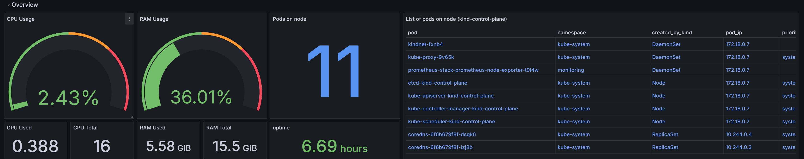
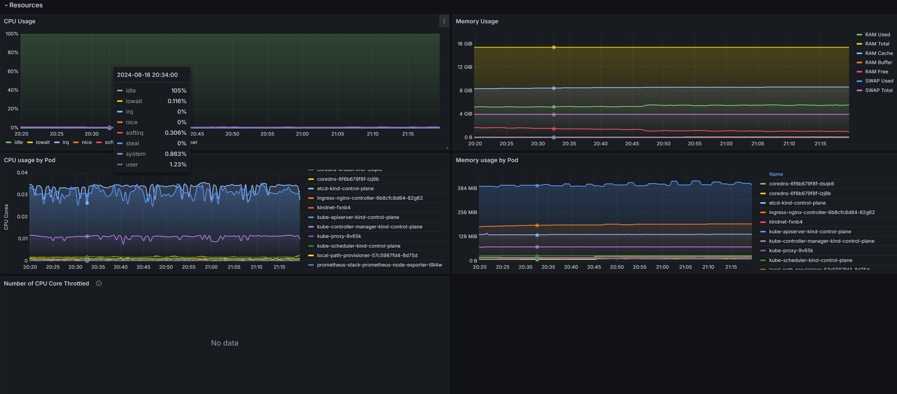
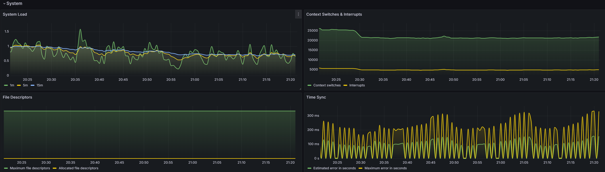
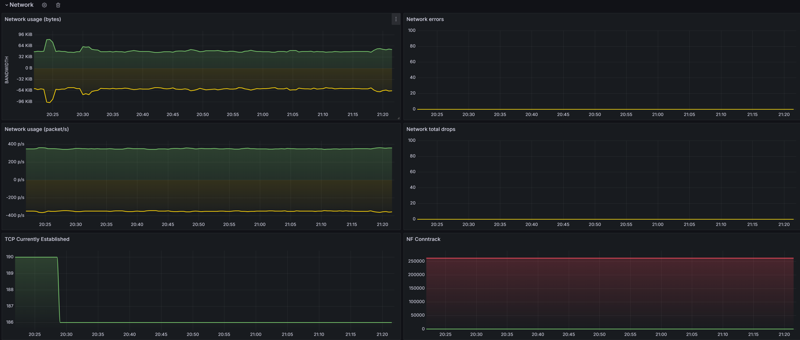
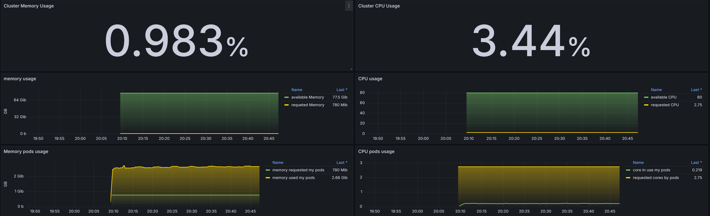
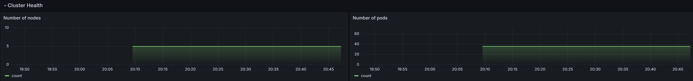
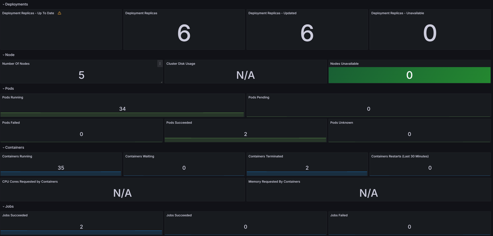

# Dynasafe assessment

## 1. 請以 kind (https://kind.sigs.k8s.io/) 架設一個 3 個節點的 control-plane，以及 2 個節點worker
我的環境是 windows WSL2 + Ubuntu 24.04，因此使用 [Using WSL2](https://kind.sigs.k8s.io/docs/user/using-wsl2/) 這個方式進行，並且安裝 Docker Desktop

### Prerequisites
- Install WSL2 Ubuntu 24.04
```shell
wsl --install -d Ubuntu-24.04
```
- Install Docker Desktop + VSCode

- Install kind and other k8s tools
```shell
# Install Kubernetes IN Docker（Kind）
# For AMD64 / x86_64
[ $(uname -m) = x86_64 ] && curl -Lo ./kind https://kind.sigs.k8s.io/dl/v0.24.0/kind-linux-amd64
chmod +x kind
sudo mv kind /usr/local/bin/

# Install kubectl
curl -LO "https://dl.k8s.io/release/$(curl -L -s https://dl.k8s.io/release/stable.txt)/bin/linux/amd64/kubectl"
sudo install -o root -g root -m 0755 kubectl /usr/local/bin/kubectl

# Install k9s
curl -sS https://webinstall.dev/k9s | bash

# Install Helm
curl https://baltocdn.com/helm/signing.asc | gpg --dearmor | sudo tee /usr/share/keyrings/helm.gpg > /dev/null
sudo apt-get install apt-transport-https --yes
echo "deb [arch=$(dpkg --print-architecture) signed-by=/usr/share/keyrings/helm.gpg] https://baltocdn.com/helm/stable/debian/ all main" | sudo tee /etc/apt/sources.list.d/helm-stable-debian.list
sudo apt-get update
sudo apt-get install helm

# Helm autocomplete
helm completion bash > /etc/bash_completion.d/helm
```

### 架設一個 3 個節點的 control-plane，以及 2 個節點 worker
- Create cluster
```shell
kind create cluster --config=kind-cluster-config.yaml
```


## 2. 安裝 Prometheus, node exporter, kube-state-metrics 在 kind 的叢集裡，Prometheus 收集 node exporter, kube-state-metrics 的效能數據
- Install Nginx Ingress Controller
```shell
# option 1 
kubectl apply -f https://raw.githubusercontent.com/kubernetes/ingress-nginx/main/deploy/static/provider/kind/deploy.yaml

# option 2
helm repo add ingress-nginx https://kubernetes.github.io/ingress-nginx
helm repo update
helm install nginx-ingress ingress-nginx/ingress-nginx --namespace ingress-nginx --create-namespace
```

- Install Prometheus k8s stack by Helm
```shell
# Add Prometheus repo
helm repo add prometheus-community https://prometheus-community.github.io/helm-charts
helm repo update

# Get values
helm show values prometheus-community > values.yaml


# Disable unused services by edit override-values.yaml

# Create Prometheus k8s stack in monitoring namespace
helm install prometheus-stack -f override-values.yaml prometheus-community/kube-prometheus-stack -n monitoring --create-namespace

# Expose prometheus for Grafana
kubectl apply -f ingress.yaml
```

## 3. 安裝 Grafana 在 kind 叢集外，以 docker 或 podman 執行，datasouce 指向 Prometheus，並呈現 2 個效能監控儀表板
- docker-compose.yaml
```shell
docker-compose up -d
```
- /etc/hosts 加上 Kind_Node_IP 對應到 prometheus.test.net，才能從 ingress 進入
```
172.18.0.7    prometheus.test.net
```

### 3.1 效能監控儀表板(1): 呈現 node 的效能監控數據
使用 dashboard ID 15759 呈現

### 3.2 效能監控儀表板(2): 呈現 kind 叢集的效能監控數據
使用 dashboard ID 16674 呈現

### 3.3 請說明以上的2個效能監控儀表板的每個panel內容
#### Node
- Overview

- Resources

- System

- Network


#### Cluster
- Overview

- Cluster health

- Others


### 3.4 請說明要如何透過建立的監控儀表板觀察 CPU Throttling 現象
在 CPU Usage panel 設置 CPU alert，並寄通知到 slack 或其他平台通知紀錄

## 4. 請部署一個容器應用程式在 kind 叢集，建立一個 hpa 物件以 cpu 使用率到達 50% 為條件，最多擴充到 10 個 pod
- 部屬 nginx-deployment.yaml
```shell
kubectl apply -f nginx-deployment.yaml
```
- 設定 HPA
```shell
kubectl apply -f nginx-hpa.yaml
```

## 後記

### Tricky 點
- Grafana 需要跟 kind 在同一網路層，而因 kind 底層是 docker，所以在 docker-compose.yaml 指定使用 kind 的網路

### 地雷
- kind 需要加 extraPortMappings，ingress 才能運作(其實也可以開 NodePort，但比較髒)
- windows 11 預設 80 port 不能用，因此改 8080 + 8443
